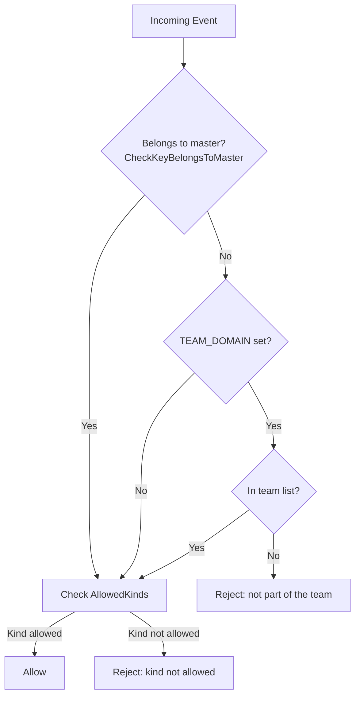
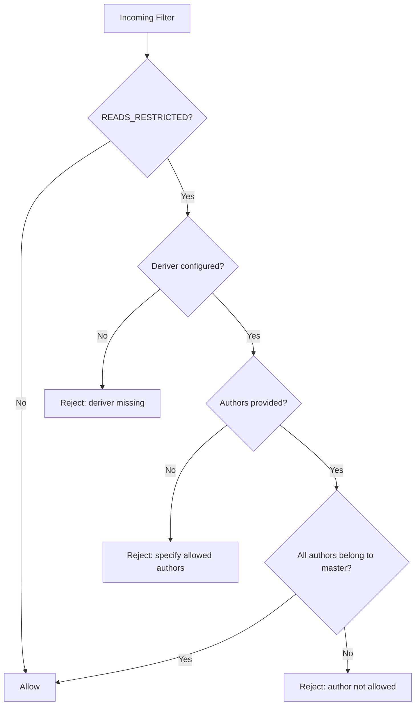
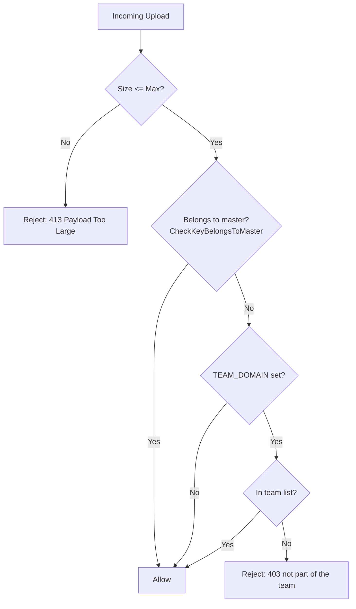

# Access Control and HD Key Logic

This document explains how Higher enforces access control using Hierarchical Deterministic (HD) keys, and how `TEAM_DOMAIN` affects the rules for both relay events and Blossom uploads.

References:
- Code: `main.go`
  - `initDeriver()` and `LoadConfig()`
  - `relay.RejectEvent` (event write policy)
  - `relay.RejectFilter` (optional read-restriction policy)
  - `bl.RejectUpload` (Blossom upload policy)
- Code: `keyderivation/hdkey.go`
  - `NewNostrKeyDeriver`, `DeriveKeyBIP32`, `GetMasterKeyPair`
  - `CheckKeyBelongsToMaster`

## Overview

- The relay enforces write/upload permissions based on whether a public key is derived from a configured master key (HD).
- The master key is configured via exactly one of:
  - `RELAY_MNEMONIC` (BIP-39 words), or
  - `RELAY_SEED_HEX` (hex-encoded 32-byte seed).
- Keys are derived using the BIP32 path: `m/44'/1237'/0'/0/index`, where `1237` is the registered Nostr coin type.
- The check function `CheckKeyBelongsToMaster(targetPubKey, maxIndex, useBIP32)` returns true if the target is either:
  - the master/root pubkey itself, or
  - any derived pubkey within indices `[0..maxIndex]` along the configured path.

## Environment Variables

- `RELAY_MNEMONIC` or `RELAY_SEED_HEX`: Exactly one must be set. Used to initialize the HD master key (see `initDeriver()` in `main.go`).
- `MAX_DERIVATION_INDEX` (default: 100): Upper bound for the index search when verifying a pubkey belongs to master.
- `TEAM_DOMAIN`: If set, `.well-known/nostr.json` from that domain is fetched periodically and used for team membership checks.
- `READS_RESTRICTED` (default: false): If true, filters must specify authors that belong to the master.
- `BLOSSOM_ENABLED`, `BLOSSOM_PATH`, `BLOSSOM_URL`: Configure Blossom integration.

## Key Belongs-To-Master Check

Function: `keyderivation/hdkey.go#CheckKeyBelongsToMaster`

- Accepts NIP-19 (`npub...`) or hex pubkeys.
- First compares target pubkey to the master/root pubkey (`GetMasterKeyPair()`). If equal, returns true.
- If not equal, derives keys for indices `[0..MAX_DERIVATION_INDEX]` on the BIP32 path and compares.

This ensures both the master key and its descendants are recognized as valid "belongs to master" keys.

## Event Write Policy (relay.RejectEvent)

Location: `main.go`

High-level rules:
- If pubkey belongs to master, allow (subject to `AllowedKinds` if configured).
- Else, if `TEAM_DOMAIN` is set, allow only if pubkey is in the team list; otherwise reject.
- If `AllowedKinds` is set, reject events whose `kind` is not in the list.

Notes:
- Team list is loaded from `https://<TEAM_DOMAIN>/.well-known/nostr.json` into `data.Names`.

## Read Restriction Policy (relay.RejectFilter)

Enabled when: `READS_RESTRICTED=true`.

Rules:
- If reads are restricted and the deriver is not configured, reject (defensive default).
- If `authors` are provided, each must belong to master; otherwise reject.
- If `authors` are not specified, reject to prevent broad reads.

## Blossom Upload Policy (bl.RejectUpload)

Location: `main.go`

Rules:
- Enforce configurable max size (`MAX_UPLOAD_SIZE_MB`).
- If pubkey belongs to master, allow.
- Else, if `TEAM_DOMAIN` is set, allow only if pubkey is in team list; otherwise reject with 403.
- Else, if `TEAM_DOMAIN` is not set and the key does not belong to master, allow (subject to size limits).

## Allowed Kinds

If `ALLOWED_KINDS` is set (comma-separated ints), both master and team members must publish only those kinds, or their events will be rejected with a clear message. See `parseAllowedKinds()` and the check in `relay.RejectEvent`.

## Troubleshooting

- Uploads/events from master key rejected:
  - Ensure exactly one of `RELAY_MNEMONIC` or `RELAY_SEED_HEX` is set.
  - Confirm the app restarted with the updated env.
  - Ensure your client uses keys that match either the master or the BIP32 path `m/44'/1237'/0'/0/index` within `MAX_DERIVATION_INDEX`.
  - If `TEAM_DOMAIN` is set, team list is only relevant for non-belongs-to-master keys.

- Derived keys not recognized:
  - Increase `MAX_DERIVATION_INDEX` if your index is higher.
  - Verify your derivation path matches the relay (Nostr coin type 1237).

- TLS/HTTP issues for Blossom:
  - The server listens on plain HTTP `:3334`. Use `http://` explicitly, or front it with an HTTPS reverse proxy.

## Examples

- Generate 5 derived keys from the mnemonic in `.env`:
  - `go run -tags genkeys ./tests/gen_keys.go`

- Run the integration tests:
  - `go test ./tests -v`

## Summary

- Master and derived keys are recognized via `CheckKeyBelongsToMaster` (master included).
- `TEAM_DOMAIN` restricts non-belongs-to-master keys to your team members.
- Optional `READS_RESTRICTED` forces queries to only target authors that belong to the master.
- Blossom enforces the same identity logic as event writes, plus size limits.
