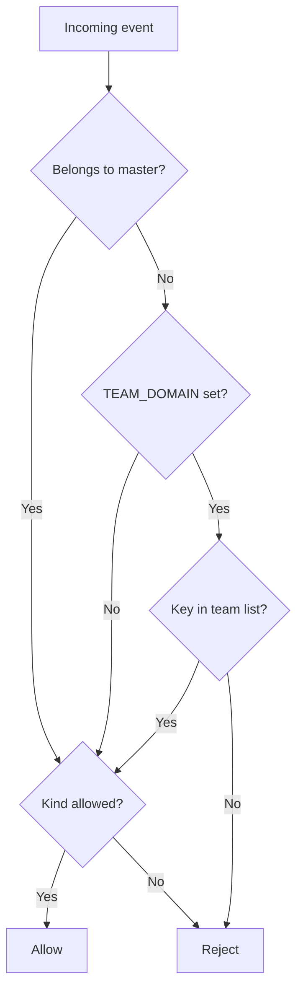
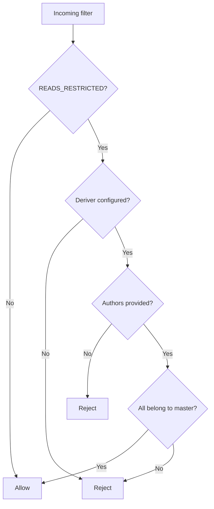
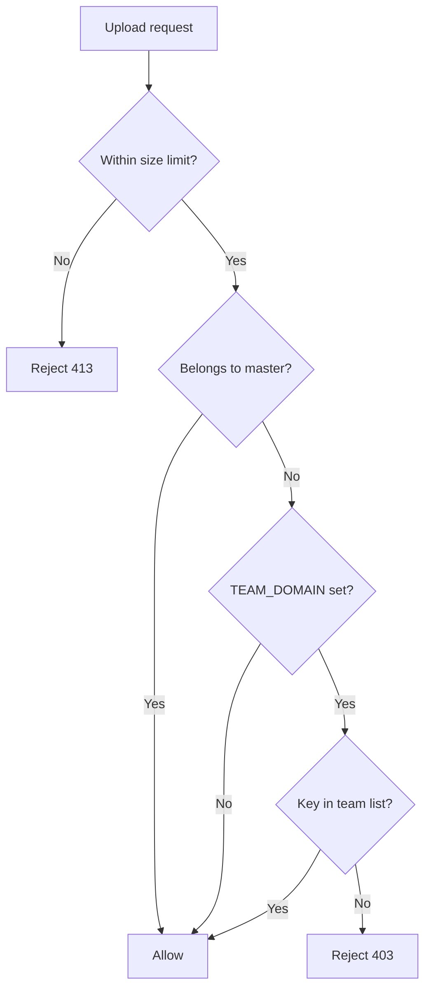

# Hierarchical Deterministic (HD) Keys in Higher Relay

This document explains how Higher implements Hierarchical Deterministic (HD) key authorization using BIP-32/44-style derivation. It also illustrates how the relay validates incoming keys for event write/read and Blossom uploads.

Key implementation files:
- `keyderivation/hdkey.go`
- `main.go` (authorization logic in `RejectEvent`, `RejectFilter`, and Blossom `RejectUpload`)

## Master key configuration

Exactly one of the following must be set in `.env` (validated in `LoadConfig()`):
- `RELAY_MNEMONIC` — BIP-39 mnemonic
- `RELAY_SEED_HEX` — hex-encoded 32-byte seed

The relay initializes the HD master in `initDeriver()` and keeps the deriver in a global `deriver` for access checks.

## Derivation scheme

The relay uses the Nostr-registered BIP44 coin type 1237 and the following path for derived keys:

- Path: `m/44'/1237'/0'/0/index`
  - `44'` — BIP44 purpose
  - `1237'` — Nostr coin type
  - `0'` — account 0
  - `0` — external chain
  - `index` — address index (non-hardened), starting at 0

Implemented in `keyderivation/hdkey.go`:
- `NewNostrKeyDeriver(...)` — builds a deriver from mnemonic or seed
- `DeriveKeyBIP32(index)` — derives a key pair at the path above
- `GetMasterKeyPair()` — returns the root (master) key

## Belongs-to-master check

Function: `CheckKeyBelongsToMaster(targetKey, maxIndex, useBIP32)`

- Accepts hex pubkeys and NIP-19 `npub...` keys.
- First compares the target against the master/root pubkey (`GetMasterKeyPair()`).
- If not the master, derives and compares keys for indices `[0..maxIndex]` on `m/44'/1237'/0'/0/index`.
- Returns `(belongs, index, error)`.

This guarantees both the master and its descendants are recognized.

```mermaid
flowchart TD
    %% belongs-to-master check
    A[Input key (hex or npub)] --> B{Decode npub?}
    B -- Yes --> C[Extract hex pubkey]
    B -- No --> D[Use as hex]
    C --> E
    D --> E
    E{Equal to master pubkey?}
    E -- Yes --> F[Return belongs=true]
    E -- No --> G[For i in 0..MAX_DERIVATION_INDEX derive pubkey(i)]
    G --> H{pubkey(i) == target?}
    H -- Yes --> F
    H -- No --> I{more i?}
    I -- Yes --> G
    I -- No --> J[Return belongs=false]
```

## Authorization logic

All authorization relies on `CheckKeyBelongsToMaster`. Additional team logic is enabled when `TEAM_DOMAIN` is set (team list loaded from `https://<TEAM_DOMAIN>/.well-known/nostr.json`).

### Event writes: `relay.RejectEvent`

- Allow if belongs-to-master (and kind is allowed, if `ALLOWED_KINDS` is set).
- Else if `TEAM_DOMAIN` is set, allow only if key is in the team list.
- Else allow (subject to allowed kinds), or reject when kinds don’t match.



### Reads (optional): `relay.RejectFilter`

Enabled when `READS_RESTRICTED=true`.
- If restricted and deriver missing → reject.
- If authors present → each must belong to master.
- If authors missing → reject (prevent broad reads).



### Blossom uploads: `bl.RejectUpload`

- Enforce `MAX_UPLOAD_SIZE_MB` first.
- If belongs-to-master → allow.
- Else if `TEAM_DOMAIN` is set → allow only if key is in team list; otherwise 403.
- Else (no `TEAM_DOMAIN`) → allow (size permitting).



## Practical notes

- Set `MAX_DERIVATION_INDEX` high enough to cover the derived indices your clients use (default is 100 in code).
- Clients must derive along the same path `m/44'/1237'/0'/0/index` for the belongs-to-master check to pass.
- When `TEAM_DOMAIN` is set, non-master non-derived keys must be present in the domain’s `.well-known/nostr.json` to be accepted.

## Code references

- `main.go`
  - `initDeriver(config)` — creates global `deriver` from mnemonic or seed
  - `relay.RejectEvent` — write policy
  - `relay.RejectFilter` — optional read restriction
  - `bl.RejectUpload` — Blossom upload policy
- `keyderivation/hdkey.go`
  - `GetMasterKeyPair()`
  - `DeriveKeyBIP32(index)`
  - `CheckKeyBelongsToMaster(target, maxIndex, useBIP32)`

## Summary

- The relay holds the HD master and validates incoming keys against the master and its derived children.
- Only the master key and keys derived along `m/44'/1237'/0'/0/index` (within `MAX_DERIVATION_INDEX`) are granted access.
- Optional team constraints (`TEAM_DOMAIN`) further restrict non-derived keys to listed members.
- The same identity policy applies consistently across event writes, reads (when restricted), and Blossom uploads.
